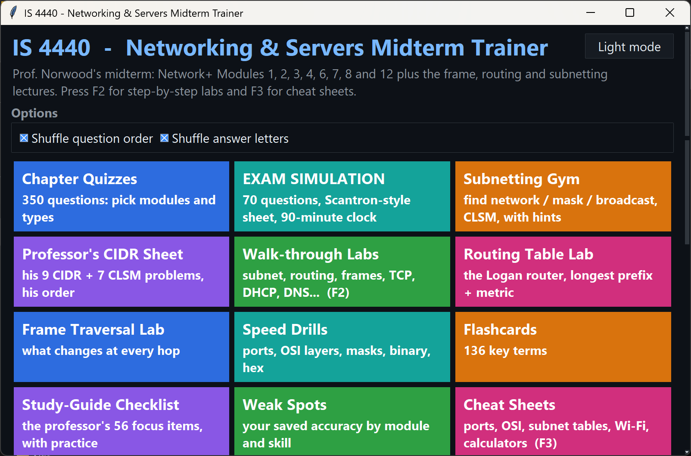
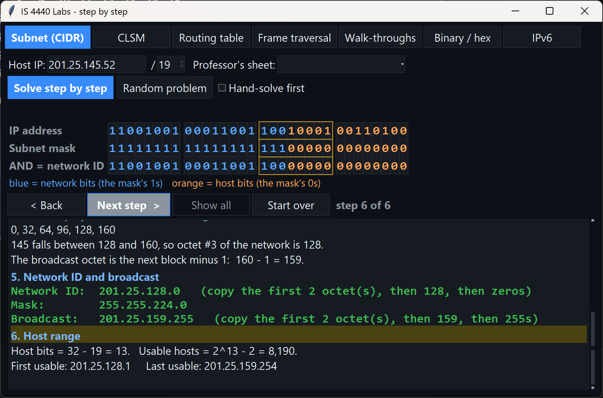
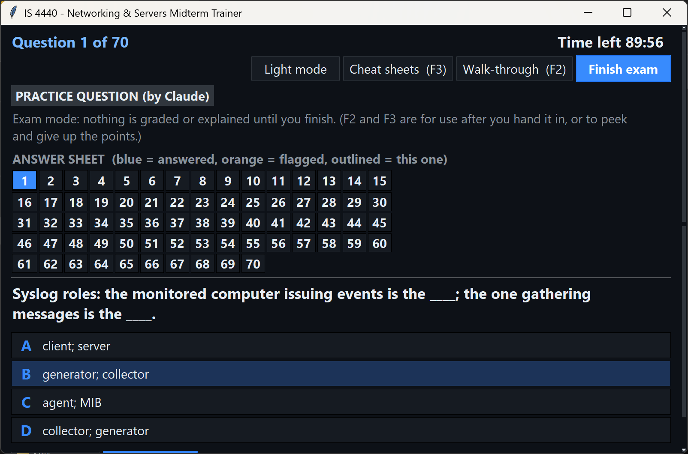
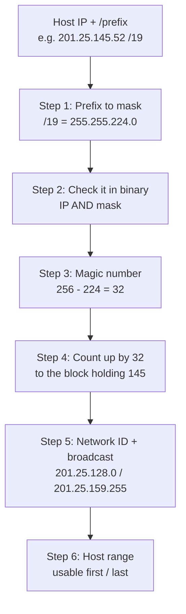

# IS 4440 – Networking & Servers Midterm Trainer

A study app for a Network+-based networking course midterm, with a full **exam simulation** and labs that **solve subnetting problems step by step**. One self-contained file; Python 3.8+ with Tkinter, no extra packages.



## Features
- **358 chapter-quiz questions** covering Network+ modules 1–4, 6–8 and 12, plus frame traversal, routing tables and subnetting
- **Exam simulation:** 70 questions, Scantron-style answer sheet, flag-for-review, and a 90-minute clock; graded only when you hand it in
- **Walk-through labs (F2):** subnet / CIDR, CLSM, routing table (longest-prefix match), frame traversal, binary/hex and IPv6
- **Randomly generated subnetting problems** with full worked solutions
- Speed drills, 136 flashcards, weak-spot tracking, study-guide checklist and cheat sheets (F3)
- Every question is tagged by source (course material, practice question, or generated); progress is saved locally

## Screenshots
| Subnet lab: worked solution | Exam simulation |
|---|---|
|  |  |

## How the subnet solver walks through a problem


## Run it
```bash
python IS4440_Midterm_Trainer.py
```
Progress (accuracy, known flashcards, checklist ticks) is saved to `~/.is4440_trainer_progress.json`.
